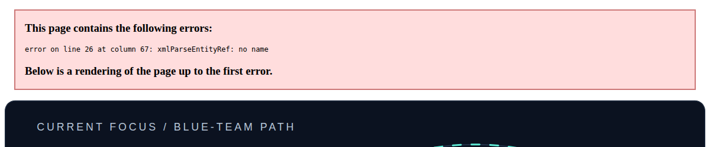
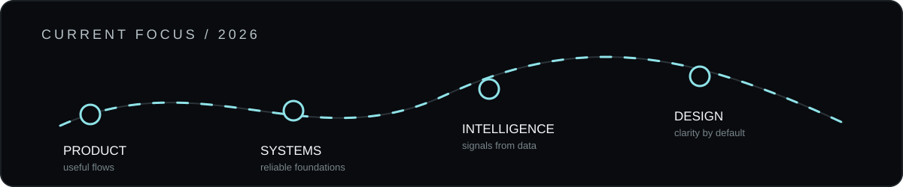
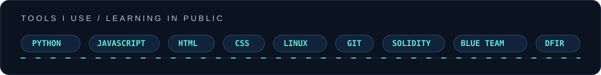
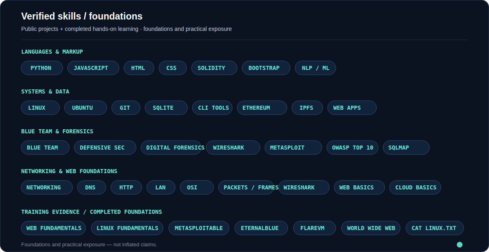
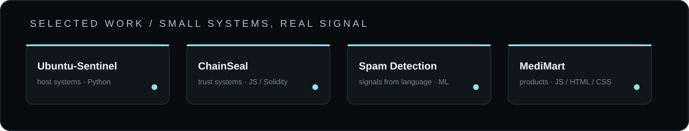

  

 

<table align="center" border="0">
  <tr>
    <td width="30%" align="center" valign="middle">
      
    </td>
    <td width="70%" valign="middle">
      
<strong>Hi, I’m Ahmad.</strong>

      <h1>Building toward stronger, safer systems.</h1>
      
My current focus is blue-team cybersecurity: growing my cybersecurity and digital-forensics knowledge while gaining practical, hands-on experience.

      
      

        
        
      

    </td>
  </tr>
</table>

Blue-team mindset · forensic curiosity · practical experience

<h2>Current focus</h2>

My current focus is <strong>blue-team cybersecurity</strong>: building stronger cybersecurity and digital-forensics knowledge while gaining practical, hands-on experience.

  
   
  

<h2>About</h2>

<table>
  <tr>
    <td width="62%" valign="top">
      
I’m a student developer focused on blue-team cybersecurity, digital forensics, and practical defensive learning. I build small systems and applications to understand how technology behaves, how evidence can be preserved, and how safer decisions can be made.

      
I care about strong fundamentals, real hands-on practice, useful outcomes, and leaving every project more understandable than I found it.

    </td>
    <td width="38%" valign="top">
      
<strong>Current focus</strong>

      
<code>blue-team security</code> <code>cybersecurity knowledge</code> <code>digital forensics</code> <code>practical experience</code>

      
<strong>Based around</strong>

      
<code>Python · JavaScript · Linux</code>

    </td>
  </tr>
</table>

<h2>Skills & tools</h2>

  
   
  

 

<table>
  <tr>
    <td width="33%" valign="top"><strong>Languages</strong> Python · JavaScript · Solidity · HTML · CSS</td>
    <td width="33%" valign="top"><strong>Systems</strong> Linux · Ubuntu · Git · SQLite · CLI tooling</td>
    <td width="33%" valign="top"><strong>Security & forensics</strong> Blue-team foundations · digital forensics · Wireshark · Metasploit · OWASP Top 10 · SQLMap</td>
  </tr>
</table>

<h2>Project signals</h2>

  

<h2>Selected work</h2>

<table>
  <thead>
    <tr>
      <th>Project</th>
      <th>What I built</th>
      <th>Stack</th>
    </tr>
  </thead>
  <tbody>
    <tr>
      <td><a href="https://github.com/ahmad12583719/Ubuntu-Sentinel"><strong>Ubuntu-Sentinel</strong></a></td>
      <td>A locally-run host monitoring and intrusion-detection system for Ubuntu.</td>
      <td><code>Python</code></td>
    </tr>
    <tr>
      <td><a href="https://github.com/ahmad12583719/TuxGuard"><strong>TuxGuard</strong></a></td>
      <td>A security-focused project exploring practical defensive tooling.</td>
      <td><code>Python</code></td>
    </tr>
    <tr>
      <td><a href="https://github.com/ahmad12583719/ChainSeal"><strong>ChainSeal</strong></a></td>
      <td>A decentralized academic credential verifier using Ethereum and IPFS.</td>
      <td><code>JS · Solidity</code></td>
    </tr>
    <tr>
      <td><a href="https://github.com/ahmad12583719/Spam_Detection"><strong>Spam_Detection</strong></a></td>
      <td>A machine-learning classifier for spam and legitimate messages.</td>
      <td><code>Python · NLP</code></td>
    </tr>
    <tr>
      <td><a href="https://github.com/ahmad12583719/MediMart"><strong>MediMart</strong></a></td>
      <td>A role-based online-pharmacy e-commerce experience.</td>
      <td><code>JS · HTML · CSS</code></td>
    </tr>
  </tbody>
</table>

<h2>Let’s connect</h2>

I’m interested in blue-team practice, digital-forensics learning, thoughtful software, and conversations that turn good ideas into useful work.

  
  

  Blue-team mindset. Practical learning. Built with intention.

